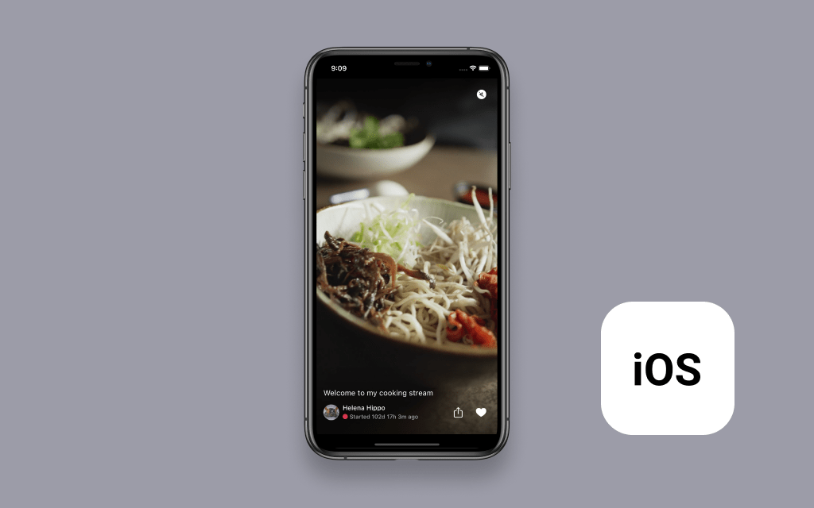

# Amazon IVS iOS Feed Demo

A demo iPhone application intended as an educational tool for demonstrating how Amazon IVS can be used to build a scrolling feed of live streams.



**This project is intended for education purposes only and not for production usage.**

This is a server-less iOS application that shows a list of Amazon IVS streams in a scrolling feed. The demo is written in [Swift](https://developer.apple.com/swift/) and showcases how customers can load and play Amazon IVS streams in a feed format.

This demo loads streams and stream metadata from a json file, which is used by the app to populate a scrolling list of streams.

## Getting Started

To run this demo, you will need the following:

1. [Xcode](https://apps.apple.com/us/app/xcode/id497799835) 11 or greater. You can build this application for devices running iOS 10 or later.
2. [Cocoapods](https://cocoapods.org/), installed and up-to-date. You can quickly install cocoapods from Terminal with `sudo gem install cocoapods`.
3. [Bundler](https://bundler.io/), installed and up-to-date.
4. [Git](https://git-scm.com/) installed and up-to-date. You can quickly install git from Terminal with `xcode-select --install`.

To run the demo in the iOS Simulator:

1. Clone the project from this repository
2. Navigate to the project directory using _Terminal_
3. Run `bundle install`, then `bundle exec pod install`
4. Open `ScrollingFeed.xcworkspace` in Xcode.
5. Click `Run` in the toolbar, or press `Cmd(⌘)-R`

You should see the iOS Simulator boot up and launch the demo app. This may take a few moments to complete. You can tap the heart icon (🤍) to spawn hearts, or the share icon (↗) to open the share sheet.

## Modifying this Example

### Prerequisites

_**IMPORTANT NOTE:** Using your own stream will create and consume AWS resources, which will cost money._

1. Create and set up an Amazon IVS channel. [Getting started with Amazon IVS](https://docs.aws.amazon.com/ivs/latest/userguide/GSIVS.html).

### Using your own Live videos

This example loads streams and stream metadata from a file `feed.json`, which provides a json object containing an array of stream objects. Each stream object represents one video in the feed. To load your own Amazon IVS stream, you will need to create and stream to an Amazon IVS channel, and modify the included `feed.json` file to include the correct metadata for your stream.

```
/* Example feed.json markup */

{
  "streams": [
	{
	  "id": <unique-stream-id>,
	  "stream": {
		"channelArn": "<channel-ARN>",
		"health": "HEALTHY",
		"playbackUrl": "<channel-playback-url>.m3u8",
		"startTime": "<stream-start-time>",
		"state": "<live-status>",
		"viewerCount": <viewer-count>
	  },
	  "metadata": {
		"streamTitle": "<stream-title>",
		"userAvatar": "<streamer-avatar>",
		"userName": "<streamer-name>",
		"userColors": {
		  "primary": "<streamer-color-1-hex>",
		  "secondary": "<streamer-color-2-hex>"
		}
	  }
	},
	{
	  "id": 1,
	  "stream": {
		...
	  },
	  ...
	},
	...
  ]
}
```

1. Open the [Amazon IVS Console](https://console.aws.amazon.com/ivs) and navigate to the channel(s) you would like to use.
2. Copy the _Playback URL_ for the channel(s). The URL should end in `.m3u8`.(For example: `https://fcc3ddae59ed.us-west-2.playback.live-video.net/api/video/v1/us-west-2.893648527354.channel.DmumNckWFTqz.m3u8`).
3. In Xcode, open `ScrollingFeed/feed.json`, and paste the `.m3u8` URL(s) from step 2, into the appropriate `playbackUrl` key(s).
4. Save and build the application.

## Documentation

- [Amazon IVS Amazon Interactive Video Service (Amazon IVS)](https://aws.amazon.com/ivs/) is a managed live streaming solution that is quick and easy to set up, and ideal for creating interactive video experiences. Simply send your live streams to Amazon IVS and the service does everything you need to make ultra-low latency live video available to any viewer around the world, letting you focus on building interactive experiences alongside the live video. [Learn more](https://aws.amazon.com/ivs/).
- [Amazon IVS docs](https://docs.aws.amazon.com/ivs/)
- [User Guide](https://docs.aws.amazon.com/ivs/latest/userguide/)
- [API Reference](https://docs.aws.amazon.com/ivs/latest/APIReference/)

## Known Issues

- The application was written for demonstration purposes and not for production use.
- Currently only tested in the us-west-2 (Oregon) region. Additional regions may be supported depending on service availability.

## License

This sample code is made available under a modified MIT license. See the LICENSE file.
